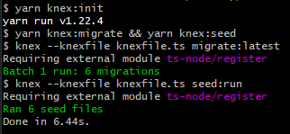

<h1 align="center">
    
</h1>

<h4 align="center"> 
  :rocket: Projeto desenvolvido para avaliação prática :rocket:
</h4>

<p align="center">
  <a href="#books-tecnologias">Tecnologias</a>&nbsp;&nbsp;&nbsp;|&nbsp;&nbsp;&nbsp;
  <a href="#information_source-configuração">Configuração</a>&nbsp;&nbsp;&nbsp;|&nbsp;&nbsp;&nbsp;
  <a href="#exemplos">Exemplos</a>&nbsp;&nbsp;&nbsp;
</p>

## :books: Tecnologias


## :information_source: Configuração

Primeiro, realize o clone do projeto com o comando abaixo:

``` bash
git clone https://github.com/erickaraujoo/senai-software-house.git
```

Entre na pasta gerada após o clone do projeto:

``` bash
cd ./senai-software-house
```

Faça a instalação dos pacotes inserindo o comando abaixo:

``` bash
yarn install
```

Após a instalação dos pacotes, é importante realizar a configuração do banco de dados (SQLite) e inserir dados para testes como forma de verificar se a configuração do banco foi realizada com sucesso. Utilize o comando abaixo

Utilizaremos o **Knex** como SQL query builder e o **SQLite** como banco de dados:

``` bash
yarn knex:init
```

Será exibido os comandos abaixo e as 2 linhas verdes onde foi feito a configuração do banco de dados e a inserção dos dados para testes



Para inicalizar a API, utilize o comando abaixo

``` bash
yarn dev
```


## Exemplos

### 1 - Cadastro de cliente

<br>

**Método:** POST

**URL:** http://localhost:3333/clients

**Body:**

``` json
{
  "name": "José Farias Nuner",
  "phone": "(71) 9512-3311",
  "email": "jose_farias@nunes.com",
  "age": 15,
  "pets": [
    {
      "name": "Mel",
      "age": 10,
      "weight": 2.5,
      "breed": "Poodle",
      "species": "Cachorro",
      "appearance": "Pelo abundante de textura fina, lanoso, bem ondulado,  elástico e resistente à pressão da mão."
    }
  ]
}
```

**Retorno:**

```json
{
  "success": true,
  "message": "create successfull",
  "payload": {},
  "errors": []
}
```

**Obs:** para o exemplo acima, o body da requisição pode ser enviado sem "pets", podendo cadastrar um cliente sem animal de estimação

### 2 - Cadastro de serviços

**Método:** POST

**URL:** http://localhost:3333/petshops/services

**Body:**

```json
{
  "petshops_id": 2,
  "name": "Banho e Tosa",
  "description": "Será feito a tosa pela Carolina, que trabalha com muita dedicação e carinho com os animais, e o banho pelo Fabio, muito cuidadoso e atencioso",
  "duration": "45 minutos",
  "total_amount": "249.99"
}
```

**Retorno:**

```json
{
  "success": true,
  "message": "create successfull",
  "payload": {},
  "errors": []
}
```

### 3 - Cadastro de agendamentos de serviços

**Método:** POST

**URL:** http://localhost:3333/petshops/services/scheduled

**Body:**

```json
{
  "petshops_services_id": 1,
  "pets_id": 1,
  "scheduling_date": "2022-08-01 13:30:00",
  "amount_already_paid": false,
  "finished_at": null
}
```

**Retorno:**

```json
{
  "success": true,
  "message": "create successfull",
  "payload": {},
  "errors": []
}
```

### 4 - Reagendar serviço

**Método:** PUT

**URL:** http://localhost:3333/petshops/services/scheduled/reschedule

**Body:**

```json
{
  "id": 1,
  "scheduling_date": "2022-10-02 21:30:00"
}
```

**Retorno:**

```json
{
  "success": true,
  "message": "create successfull",
  "payload": {},
  "errors": []
}
```

Os testes acima foram criados utilizando Insomnia. Há um arquivo chamado "collection-insomnia.json" na raiz do projeto, este arquivo pode ser importado no Insomnia para realizar os testes de forma automática com as endpoints criadas.

**Outras endpoints:**

| Método | URL                                         | Descrição                         |
| :----: | :-----------------------------------------: | :-------------------------------: |
| GET    | http://localhost:3333/clients               | Retorna todos os clientes         |
| GET    | http://localhost:3333/clients/:id           | Retorna cliente por ID            |
| GET    | http://localhost:3333/clients/:id/pets      | Retorna animais por ID do cliente |
| GET    | http://localhost:3333/pets                  | Retorna todos os animais          |
| GET    | http://localhost:3333/pets/:id              | Retorna animal por ID             |
| GET    | http://localhost:3333/petshops              | Retorna todos os petshops         |
| GET    | http://localhost:3333/petshops/:id          | Retorna petshop por ID            |
| GET    | http://localhost:3333/petshops/:id/services | Retorna serviços de um petshop    |

--- 

Made by Erick Araujo!
